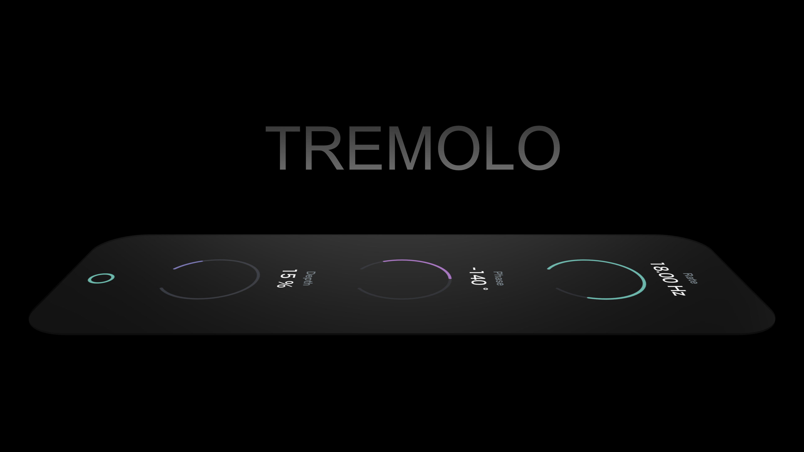
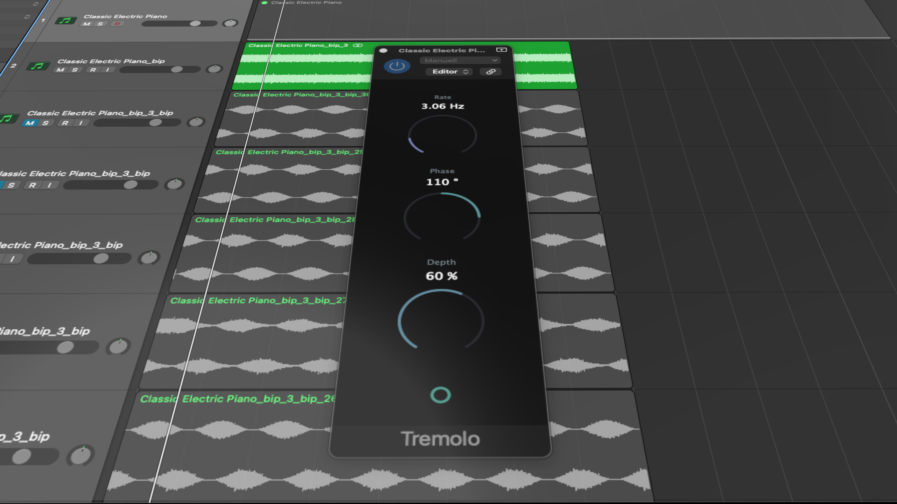

# Tremolo
This is a simple Tremolo Plugin created with [Juce](https://juce.com/).

## Contents
[Features](#features)  
[How to Install](#how-to-Install)
 
## Features
Four automatable parameters: 
 
* **Rate**: Tremolo frequency in Hz
* **Phase**: Generates offset of the Termeolo effect on channels clockwise (for positive values) or counterclockwise (for negative values) by the set value in degrees.
* **Depth**: Intensity of the effect in percent
* **Bypass**: Turns effect off (or on)

## How to Install

### Supported formats:

* VST3 [Download](https://github.com/OliverHoenig/Tremolo/raw/main/Releases/v1.0/Tremolo.vst3.zip)
* AU [Download](https://github.com/OliverHoenig/Tremolo/raw/main/Releases/v1.0/Tremolo.component.zip)

### Installation:
1. Go to the **"Release"-folder** and download the format that suits you best
2. **Move the file** into the appropriate folder of your host (e.g. DAW), so that it recognizes the plug-in. (See [Installation locations](#installation-locations))
3. **Restart your host** and **scan new plugins** if necessary. The plugin should now be recognized and usable in the host.

### Installation locations:

**_MacOS_**

| Format | Direcotry Type |           Mac Installation Direcotry           |
|:------:|:--------------:|:----------------------------------------------:|
| VST    | User           | ~/Library/Audio/Plug-Ins/VST                   |
|        | System         | Macintosh HD/Library/Audio/Plug-Ins/VST        |
| VST3   | User           | ~/Library/Audio/Plug-Ins/VST3                  |
|        | System         | Macintosh HD/Library/Audio/Plug-Ins/VST3       |
| AU     | User           | ~/Library/Audio/Plug-Ins/Components            |
|        | System         | Macintosh HD/Library/Audio/Plug-Ins/Components |

**_Windows_**

| Format 	| Direcotry Type 	|          Mac Installation Direcotry          	|
|:------:	|:--------------:	|:--------------------------------------------:	|
| VST    	| Shared         	| C:\Program Files\VstPlugins                  	|
|        	| Shared         	| C:\Program Files\Steinberg\VstPlugins        	|
|        	| Shared         	| C:\Program Files\Common Files\VST2           	|
|        	| Shared         	| C:\Program Files\Common Files\Steinberg\VST2 	|
| VST3   	| Shared         	| C:\Program Files\Common Files\VST3           	|

 
