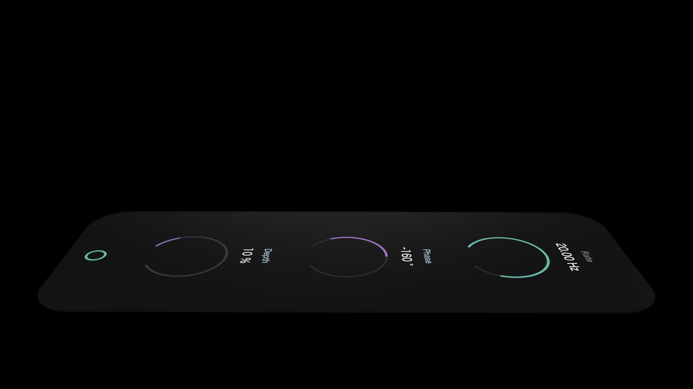
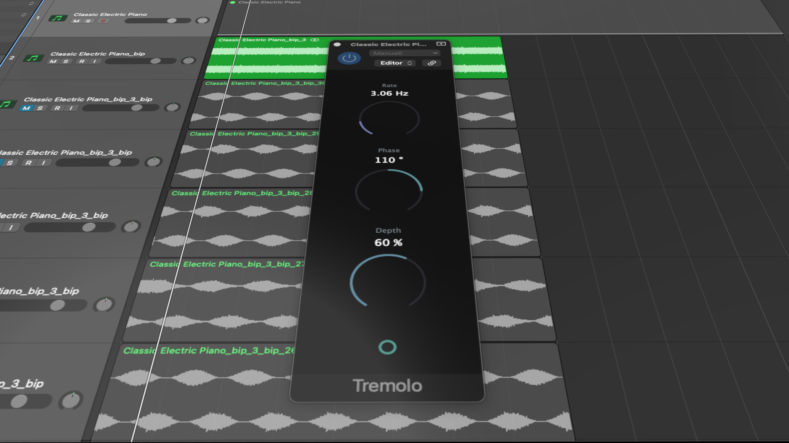

# Tremolo
This is a simple Tremolo Plugin created with [Juce](https://juce.com/)
 
## Features
Four automatable parameters: 
 
* **Rate**: Tremolo frequency in Hz
* **Phase**: Generates offset of the Termeolo effect on channels clockwise (for positive values) or counterclockwise (for negative values) by the set value in degrees.
* **Depth**: Intensity of the effect in percent
* **Bypass**: Turns effect off (or on)

## How to Install

### Supported formats:

* VST
* VST3
* AU

### Installation:
1. Go to the **"Release"-folder** and download the format that suits you best
2. **Move the file** into the appropriate folder of your host (e.g. DAW), so that it recognizes the plug-in.
3. **Restart your host** and **scan new plugins** if necessary. The plugin should now be recognized and usable in the host.

 
